# 求人自動送信システム ユーザーマニュアル

---

## このマニュアルについて

このシステムは、**LINEユーザーがフォームに回答すると、その回答内容に合った求人情報を自動でLINEに送信する**仕組みです。

普段の業務で行う操作は主に以下の2つです。

1. **求人を登録する**（新しい求人を追加する）
2. **求人の有効・無効を管理する**（送信対象を切り替える）

ログの確認方法も本マニュアルに記載しています。

---

## 目次

- [システムの全体像](#1-システムの全体像)
- [スプレッドシートを開く](#2-スプレッドシートを開く)
- [求人を登録する](#3-求人を登録する)
- [求人の有効・無効を管理する](#4-求人の有効無効を管理する)
- [ログを確認する](#5-ログを確認する)
- [事前設定項目](#50-事前設定項目)
- [確認項目](#100-仕様確認項目)

---

## 1. システムの全体像

### 何が自動で行われるか

```
LINEユーザーがフォームに回答する
        ↓
LStepがスプレッドシートに回答データを書き込む
        ↓
システムが自動で起動する
        ↓
回答内容に合った求人グループを探す
        ↓
まだ送っていない求人を選ぶ（最大x件）
        ↓
ユーザーのLINEに求人情報を自動送信する
```

**イメージ図**
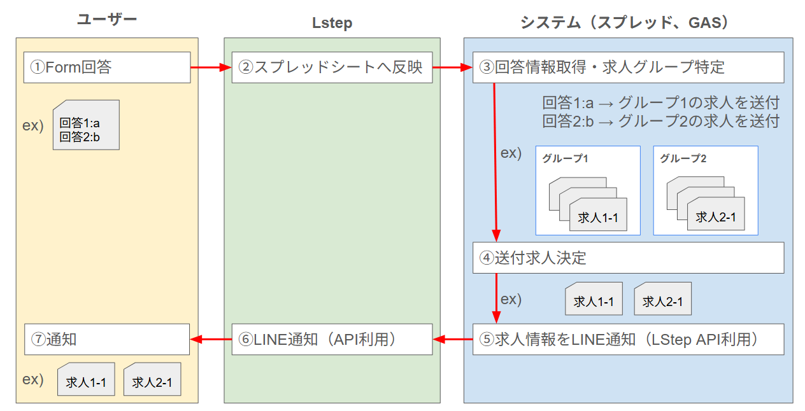

### 送信されるメッセージの例

```
■求人名：○○不動産　営業スタッフ
■給与：月給25万円〜
■勤務形態：週5日 9:00〜18:00
詳しくはこちら↓
https://www.homes.co.jp/...
```

---

## 2. スプレッドシートを開く

スプレッドシートを開くと、画面上部のメニューに **「求人管理」** というメニューが表示されます。

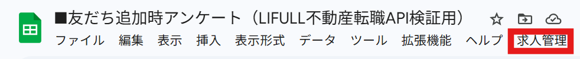

「求人管理」が表示されない場合は、**ページを再読み込み**してください。それでも表示されない場合は管理者に連絡してください。

---

## 3. 求人を登録する

新しい求人をシステムに追加する手順です。

### 3-1. 求人登録画面を開く

スプレッドシートのメニューから **「求人管理」→「求人を登録」** をクリックします。

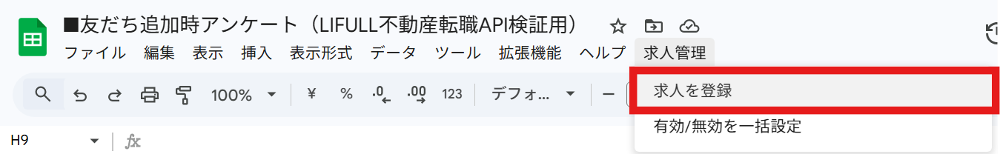

数秒後に求人登録ダイアログが表示されます。

### 3-2. 入力項目を埋める

| 項目       | 入力内容                                         | 例                                                    |
| ---------- | ------------------------------------------------ | ----------------------------------------------------- |
| グループID | この求人を送る対象グループの番号                 | `1`                                                   |
| 求人URL    | HOMESの求人ページURL                             | `https://www.homes.co.jp/fudousantensyoku/job/xxxxx/` |
| 有効にする | 登録直後から送信対象にする場合はチェックを入れる | ✓                                                     |

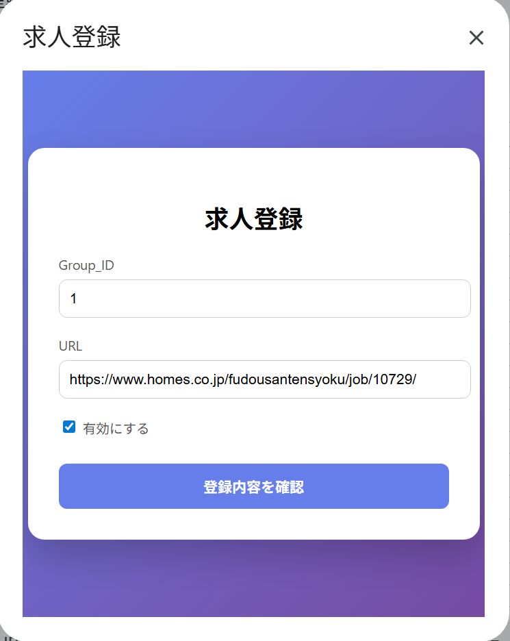

**グループIDについて：**
グループIDは、どの回答パターンのユーザーに送るかを決める番号です。
どのグループIDを使うかは `Form_Group` シートを参照してください。

### 3-3. 登録ボタンを押す

入力が終わったら「登録」ボタンをクリックします。

- 求人名・給与・勤務形態はURLのページから**自動で取得**されます（入力不要です）。
- 登録が完了すると成功メッセージが表示されます。

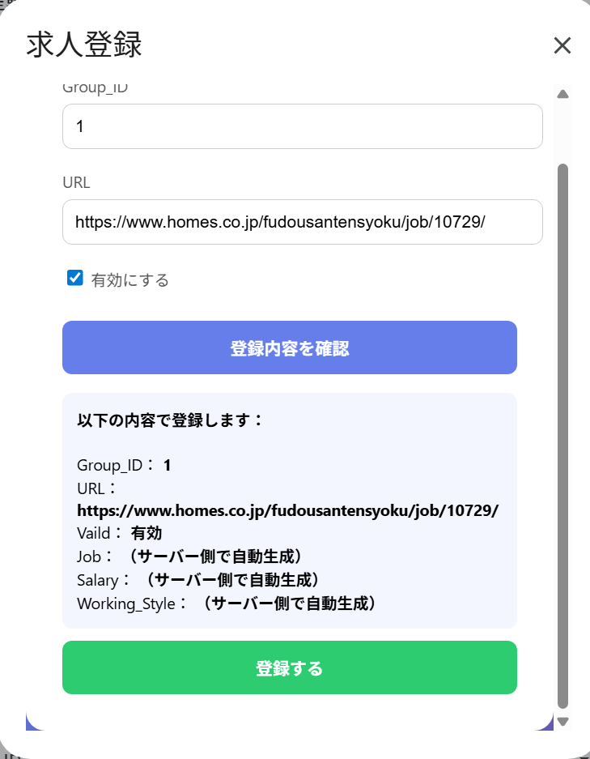
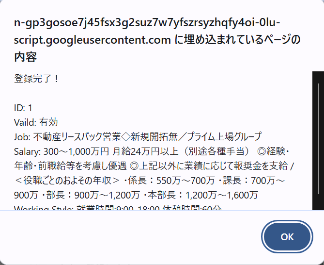

### 3-4. 登録結果を確認する

`Job_Opening` シートを開いて、登録した求人が末尾に追加されていることを確認してください。

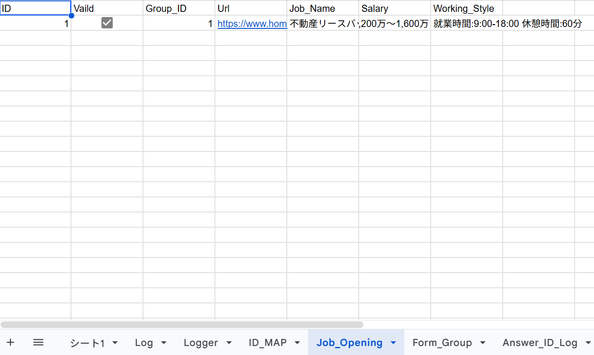

| 列名          | 内容                                         |
| ------------- | -------------------------------------------- |
| ID            | 自動で付与される番号                         |
| Vaild         | 有効フラグ（チェックが入っていると送信対象） |
| Group_ID      | 登録時に入力したグループID                   |
| Url           | 入力した求人URL                              |
| Job_Name      | 自動取得された求人名                         |
| Salary        | 自動取得された給与情報                       |
| Working_Style | 自動取得された勤務形態                       |

---

## 4. 求人の有効・無効を管理する

登録済みの求人を送信対象にするか外すかを一括で管理できます。

### 4-1. 求人管理画面を開く

スプレッドシートのメニューから **「求人管理」→「有効/無効を一括設定」** をクリックします。

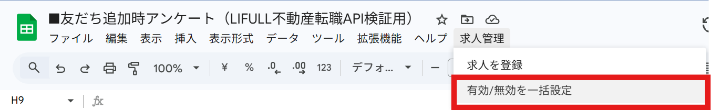

### 4-2. 一覧画面で確認する

登録されている全求人が一覧表示されます。

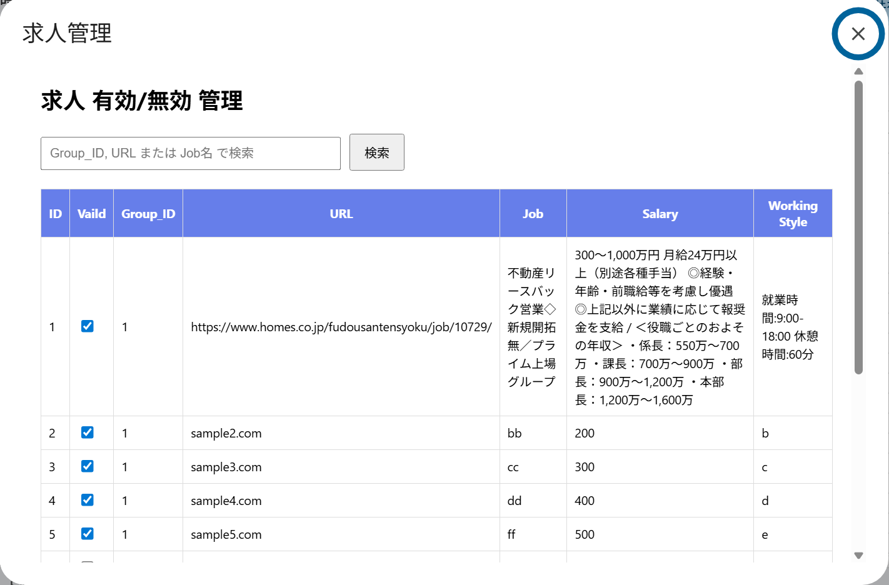

| 表示項目   | 内容                               |
| ---------- | ---------------------------------- |
| ID         | 求人の番号                         |
| 求人名     | 登録時に自動取得された求人名       |
| グループID | 送信対象のグループ番号             |
| 有効       | チェックが入っている求人が送信対象 |

### 4-3. 有効・無効を切り替える

送信したくない求人のチェックを**外す**、送信したい求人に**チェックを入れる**、と操作してから「保存」ボタンをクリックします。

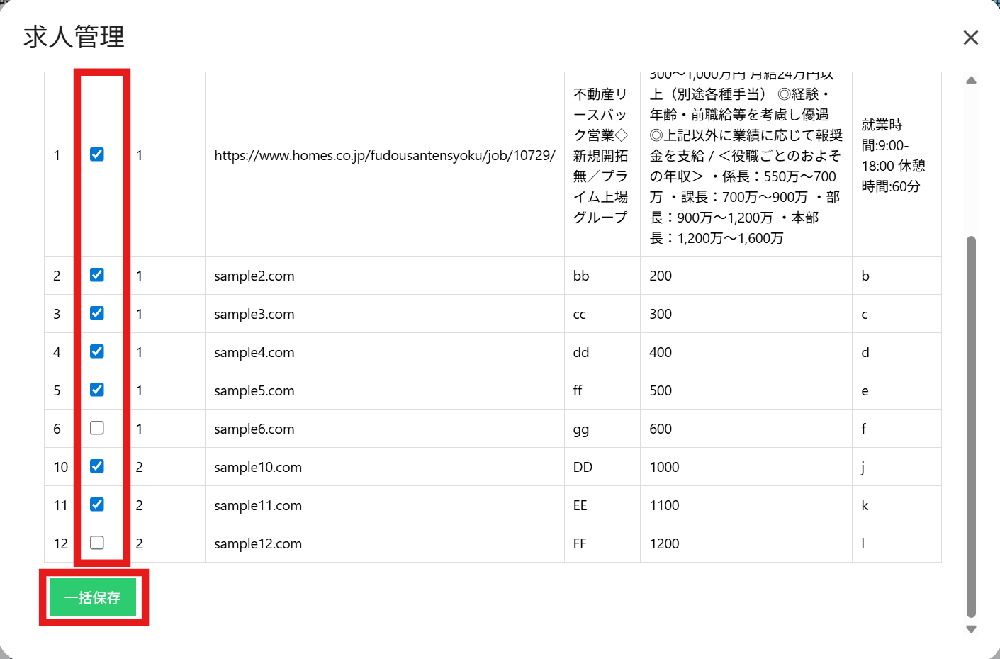

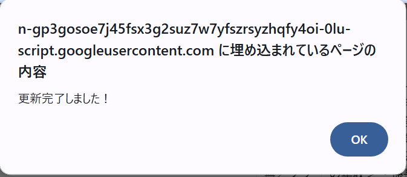

### 4-4. シートで直接確認する場合

`Job_Opening` シートの **`Vaild`** 列でも確認・変更できます。

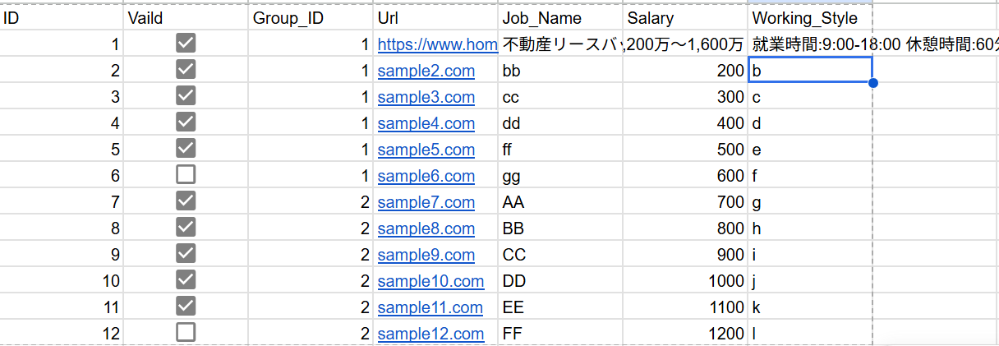

- チェックあり（TRUE）→ 送信対象
- チェックなし（FALSE）→ 送信対象外

---

## 5. ログを確認する

送信が正常に行われたかどうかは、以下のシートで確認できます。

### 5-1. Log シート（業務ログ）

フォームへの回答1件ごとの送信結果が記録されます。

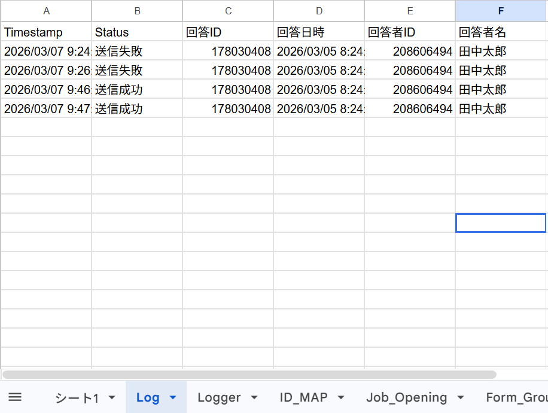

| 列名      | 内容                             |
| --------- | -------------------------------- |
| Timestamp | 処理が行われた日時               |
| Status    | `送信成功` または `送信失敗`     |
| 回答ID    | フォームの回答ID                 |
| 回答日時  | ユーザーがフォームに回答した日時 |
| 回答者ID  | LStepのユーザーID                |
| 回答者名  | 回答したユーザーの名前           |

**ステータスの見方：**

| Status     | 意味                                 |
| ---------- | ------------------------------------ |
| `送信成功` | 問題なくLINEに求人を送れた           |
| `送信失敗` | 何らかのエラーが発生して送れなかった |

## 50. 事前設定項目

---

## 1. Form_Groupシートの設定（回答マッピング）

このシートが、フォームの回答内容が「どの求人グループに属するか」を紐付ける設定です。
**ステップ6でFORM_HEADERを確定した後に行ってください。**

### 1.1 Form_Groupシートのヘッダーを設定する

ステップ1で `Group_ID` だけ入力したヘッダー行に、B列以降を追加します。（回答フォームの質問項目になります。）
**B1以降はFORM_HEADERの値（右辺の文字列）と完全一致する列名を入力してください。**

例：

| A        | B            | C                  | D                      | E                      |
| -------- | ------------ | ------------------ | ---------------------- | ---------------------- |
| Group_ID | 希望する職種 | 希望する勤務エリア | 年代を教えてください。 | 宅建を持っていますか？ |

### 1.2 回答パターンとGroup_IDのデータを入力する

2行目以降に、回答の組み合わせとGroup_IDを入力します。

#### 設定の考え方

- **Group_ID**：求人グループを識別するID（数字推奨、例：1, 2, 3…）
- **回答列の値**：該当する回答を入力。複数入力可能な項目の場合、分けて入力をします。回答の組み合わせをすべて網羅する必要があります。

#### 設定例

以下のようなLStepフォームがある場合：

- 質問1：希望する職種（営業 / 事務 / IT）
- 質問2：希望する勤務エリア（東京 / 大阪 / 名古屋）

| Group_ID | 希望する職種 | 希望する勤務エリア | 年代を教えてください。 | 宅建を持っていますか？ |
| -------- | ------------ | ------------------ | ---------------------- | ---------------------- |
| 1        | 営業         | 東京               |                        |                        |
| 2        | 営業         | 大阪               |                        |                        |
| 3        | 事務         |                    |                        |                        |
| 4        |              |                    |                        | はい                   |

上記の場合：

- 「営業・東京」と回答したユーザーには Group_ID=1 の求人を送信
- 「事務・名古屋」と回答したユーザーには Group_ID=3 の求人を送信（エリア列が空欄＝ワイルドカード）
- 複数のGroup_IDに一致した場合は、それぞれのグループの求人を合算して送信

## 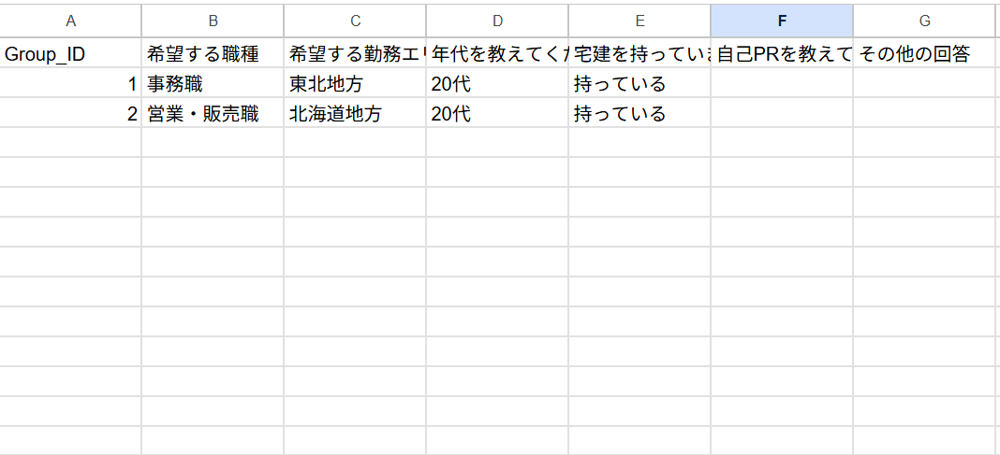

---

## 100. 仕様確認項目

---

| #   | 概要                                   | 確認内容内容                                                                          |
| --- | -------------------------------------- | ------------------------------------------------------------------------------------- |
| 1   | 対象サイトのHTML構造                   | 求人サイトのHTML構造が変わらないこと または、特定のHTML構造下のみで動作することの合意 |
| 2   | 複数グループにまたがる求人送信のルール | 　求人グループが複数にまたがる場合の送信ルールはどうするか                            |
| 3   | LINEグループ通知機能                   | LINEへの返信失敗時などでLINEグループにて通知する機能が必要かどうか                    |
| 4   | 回答Form更新時の対応について           | 回答Formの質問時の変更があった場合、システムを更新する必要があります。                |

---

### 100-1. スクレイピング対象サイトのHTML構造

**[仕様確認]**

現在 HOMES（`homes.co.jp`）の求人ページHTML構造に固定されている。

| 依存箇所                  | 内容                               |
| ------------------------- | ---------------------------------- |
| `section[class*="cont1"]` | 求人情報が含まれるセクションの特定 |
| `h1` タグ                 | 求人名の取得                       |
| `h3` + `p` タグの繰り返し | 各項目（給与・勤務時間など）の取得 |

他のサイトURLを登録した場合、この構造が存在しないためスクレイピングが失敗するため、
上記構造以外のものは求人登録時の求人名、給与、勤務時間の自動取得ができません。
下記画像の赤枠部分の構造のことを指してます。
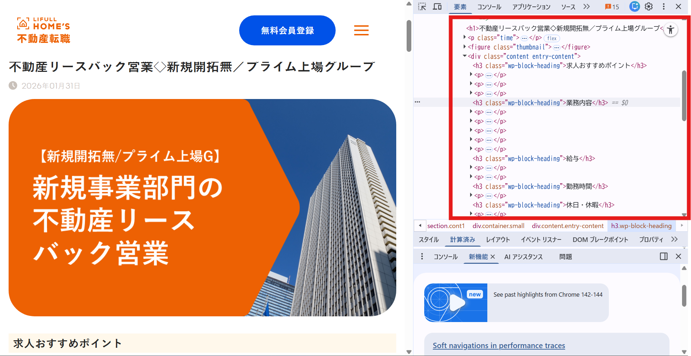

### 100-2. 複数グループにまたがる求人送信のルール

**[仕様確認]**

回答結果によっては複数の求人グループが対象となる場合があります。
その場合、どのように求人を送信するか。

例）
該当する求人グループ：1,2
ルール：グループ1から1通、グループ2から1通の通知

### 100-3. LINEグループ通知機能

**[仕様確認]**

エラー発生時や、メッセージの送信失敗時などLINEグループへ通知を送る機能を追加することができます。
※エラー以外でも送信することは可能です。

通知用のBotを入れたLINEグループを作成する必要があります。

### 100-4. 回答Form更新時の対応について

**[制約事項]**

回答Formの質問更新が行われる場合などスプレッドシートが既存のものと変わる場合に関しては、システムを移管する作業が発生します。そのため、回答Formの更新が発生する際は事前にご連絡をお願いします。

## 付録：シート一覧

スプレッドシートの構成は下記となります。

| シート名        | 役割                             | 通常の操作                     |
| --------------- | -------------------------------- | ------------------------------ |
| `シート1`       | LStepのフォーム回答データ        | 自動書き込み（触らない）       |
| `Job_Opening`   | 求人情報マスタ                   | システムで使用（通常触らない） |
| `Form_Group`    | 回答パターンとグループIDの対応表 | ユーザーにて登録               |
| `ID_MAP`        | ユーザーごとの送信済み求人ID     | システムで使用（触らない）     |
| `Log`           | 業務処理ログ                     | 確認のみ                       |
| `Answer_ID_Log` | 回答ID単位の処理ログ             | システムで使用（触らない）     |
| `Logger`        | システム内部ログ                 | システムで使用（触らない）     |
| `Setting`       | システム設定値                   | 必要であれば設定               |
